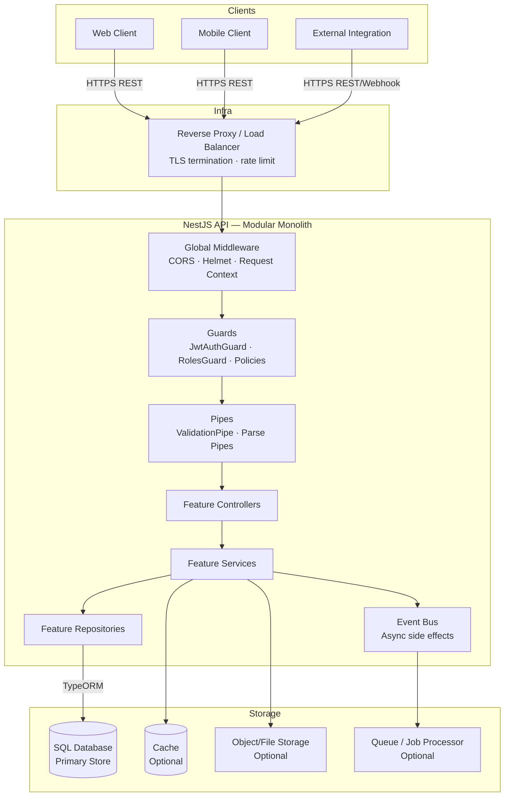
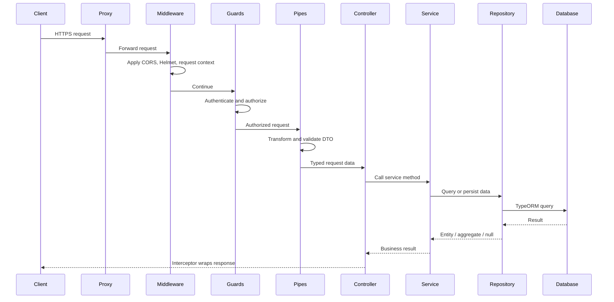
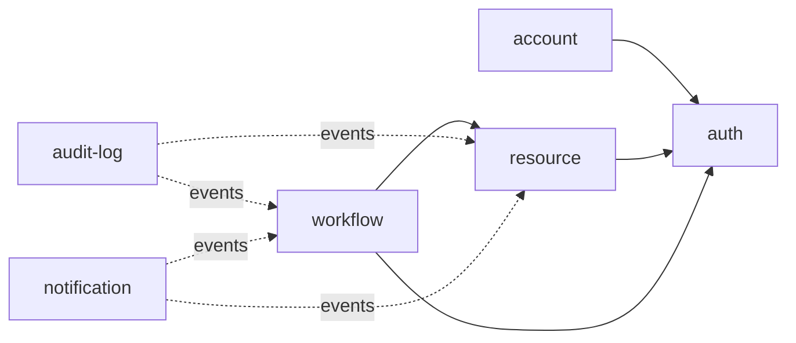

# Backend Architecture — NestJS Reusable Template

## System Overview



**Architecture:** NestJS modular monolith with feature-based modules.

| Decision | Rationale |
|----------|-----------|
| Modular monolith first | Keeps development and deployment simple while preserving domain boundaries |
| Feature-based modules | Each module owns a business capability and can be tested independently |
| Shared/core separation | Keeps reusable helpers separate from infrastructure setup |
| Repository pattern | Keeps persistence logic separate from business rules |
| Events for side effects | Reduces coupling for notifications, audit logs, indexing, analytics, and integrations |

---

## Folder Structure

```text
src/
├── main.ts                             # Bootstrap: global pipes, filters, interceptors, Swagger
├── app.module.ts                       # Root module: imports config, core, shared, features
│
├── config/                             # Typed configuration; no raw process.env outside here
│   ├── app.config.ts                   # PORT, NODE_ENV, API_PREFIX, CORS_ORIGIN
│   ├── database.config.ts              # DB connection settings
│   ├── auth.config.ts                  # JWT/session settings
│   ├── storage.config.ts               # Optional file/object storage settings
│   └── queue.config.ts                 # Optional queue settings
│
├── core/                               # Infrastructure setup; no business logic
│   ├── database/
│   │   └── database.module.ts          # TypeORM setup
│   ├── logger/
│   │   └── logger.module.ts            # Structured logger setup
│   ├── cache/                          # Optional cache module
│   ├── queue/                          # Optional queue module
│   └── storage/                        # Optional storage module
│
├── shared/                             # Cross-feature reusable code
│   ├── decorators/
│   │   ├── current-user.decorator.ts
│   │   ├── roles.decorator.ts
│   │   └── public.decorator.ts
│   ├── filters/
│   │   └── http-exception.filter.ts
│   ├── guards/
│   │   ├── jwt-auth.guard.ts
│   │   └── roles.guard.ts
│   ├── interceptors/
│   │   ├── transform.interceptor.ts
│   │   └── logging.interceptor.ts
│   ├── pipes/
│   │   └── validation.pipe.ts
│   ├── utils/
│   │   ├── pagination.util.ts
│   │   ├── hash.util.ts
│   │   └── date.util.ts
│   └── types/
│       ├── api-response.type.ts
│       ├── pagination.type.ts
│       └── auth-payload.type.ts
│
└── features/
    ├── auth/                           # Identity, login, token lifecycle
    ├── account/                        # User/account profile data
    ├── resource/                       # Example domain feature; rename per project
    ├── workflow/                       # Optional orchestration feature
    ├── audit-log/                      # Optional audit trail
    └── notification/                   # Optional notification feature
```

---

## Feature Anatomy

### Simple Feature

```text
features/resource/
├── resource.module.ts
├── resource.controller.ts
├── resource.service.ts
├── repositories/
│   └── resource.repository.ts
├── dto/
│   ├── create-resource.dto.ts
│   ├── update-resource.dto.ts
│   ├── query-resource.dto.ts
│   └── resource-response.dto.ts
├── entities/
│   └── resource.entity.ts
├── types/
│   └── resource-status.type.ts
├── events/
│   ├── resource-created.event.ts
│   └── resource.listener.ts
├── tests/
│   ├── resource.service.spec.ts
│   ├── resource.controller.spec.ts
│   └── resource.repository.spec.ts
└── CONTEXT.md
```

### Complex Feature With Multiple Sub-Resources

```text
features/workspace/
├── workspace.module.ts
├── controllers/
│   ├── workspace.controller.ts
│   ├── member.controller.ts
│   └── invitation.controller.ts
├── services/
│   ├── workspace.service.ts
│   ├── member.service.ts
│   └── invitation.service.ts
├── repositories/
│   ├── workspace.repository.ts
│   ├── member.repository.ts
│   └── invitation.repository.ts
├── entities/
│   ├── workspace.entity.ts
│   ├── member.entity.ts
│   └── invitation.entity.ts
├── dto/
├── types/
├── events/
├── tests/
└── CONTEXT.md
```

### Feature With Transaction Logic

```text
features/workflow/
├── workflow.module.ts
├── workflow.controller.ts
├── services/
│   ├── workflow.service.ts             # Read/status operations
│   └── workflow-execution.service.ts   # Multi-step transactional operation
├── repositories/
│   ├── workflow.repository.ts
│   └── workflow-step.repository.ts
├── entities/
│   ├── workflow.entity.ts
│   └── workflow-step.entity.ts
├── dto/
├── events/
├── tests/
└── CONTEXT.md
```

---

## Request Lifecycle



### Layer Responsibilities

| Layer | Responsibility | Must not |
|-------|----------------|----------|
| Controller | Route mapping, DTO binding, params/query extraction, status code hints | Contain business rules |
| Service | Business logic, orchestration, transactions, cross-feature coordination | Build complex SQL queries directly |
| Repository | TypeORM queries, joins, locking, persistence | Enforce business policy |
| Guard | Authentication and authorization | Execute business workflows |
| Pipe | Transform and validate request input | Make domain decisions that need repositories |
| Filter | Convert exceptions to standard error envelope | Swallow exceptions |
| Interceptor | Wrap responses, log lifecycle, add metadata | Mutate business meaning |
| Event listener | Handle async side effects | Block the main request with noncritical work |

---

## Generic Transaction Flow

Use this pattern for any multi-step operation that must be atomic.

```text
POST /[resource]/[action]
  ↓ JwtAuthGuard or public access policy
  ↓ ValidationPipe validates ActionDto
  ↓ Controller.action()
  ↓ ActionService.execute(actorId, dto)
      1. Load required records
      2. Validate ownership and permissions
      3. Validate business state transition
      4. BEGIN TRANSACTION
          a. Update primary record
          b. Write related records
          c. Insert audit/outbox record if needed
      5. COMMIT
      6. Emit domain event after successful commit
  ↓ Return ActionResponseDto
```

Implementation pattern:

```ts
async execute(actorId: number, dto: ExecuteWorkflowDto): Promise<WorkflowResponseDto> {
  const queryRunner = this.dataSource.createQueryRunner();
  await queryRunner.connect();
  await queryRunner.startTransaction();

  try {
    const workflow = await this.workflowRepository.findForUpdate(dto.workflowId, queryRunner.manager);
    if (!workflow) {
      throw new NotFoundException('Workflow not found');
    }

    workflow.markAsExecuted(actorId);
    await queryRunner.manager.save(workflow);

    await queryRunner.commitTransaction();

    this.eventEmitter.emit('workflow.executed', {
      workflowId: workflow.id,
      actorId,
    });

    return WorkflowResponseDto.fromEntity(workflow);
  } catch (error) {
    await queryRunner.rollbackTransaction();
    throw error;
  } finally {
    await queryRunner.release();
  }
}
```

---

## Cross-Feature Communication

### Generic Dependency Graph



### Allowed Patterns

```ts
// Synchronous dependency through module import
@Module({
  imports: [ResourceModule],
  providers: [WorkflowService],
})
export class WorkflowModule {}
```

```ts
// Async side effect through event
this.eventEmitter.emit('resource.updated', {
  resourceId: resource.id,
  actorId,
});
```

```ts
@OnEvent('resource.updated')
async handleResourceUpdated(payload: ResourceUpdatedEvent): Promise<void> {
  await this.auditLogService.record({
    action: 'resource.updated',
    actorId: payload.actorId,
    targetId: payload.resourceId,
  });
}
```

Forbidden:

```ts
import { ResourceRepository } from '../resource/repositories/resource.repository';
import { Resource } from '../resource/entities/resource.entity';
```

---

## Shared vs Core vs Feature

| Layer | Location | Contains | Example |
|-------|----------|----------|---------|
| Config | `src/config/` | Typed environment mapping | `database.config.ts`, `auth.config.ts` |
| Core | `src/core/` | Infrastructure modules and adapters | Database, logger, cache, queue, storage |
| Shared | `src/shared/` | Cross-feature reusable helpers | Guards, decorators, interceptors, pagination utils |
| Feature | `src/features/[feature]/` | Domain logic and owned data | Controllers, services, repositories, entities |

Decision rules:

- If it needs `DataSource`, network clients, Redis, queue drivers, or storage SDKs, place it in `core/`.
- If it is reused by multiple features and has no domain ownership, place it in `shared/`.
- If it belongs to one business capability, keep it inside that feature.
- If shared code starts accumulating business rules, move those rules back into the owning feature.

---

## Configuration Management

### Environment Variables

```bash
# Application
PORT=3000
NODE_ENV=development
API_PREFIX=api/v1
CORS_ORIGIN=http://localhost:3000

# Database
DB_HOST=localhost
DB_PORT=3306
DB_USERNAME=root
DB_PASSWORD=secret
DB_NAME=app_db

# Auth
JWT_SECRET=replace-with-minimum-32-character-random-string
JWT_EXPIRES_IN=15m
JWT_REFRESH_EXPIRES_IN=7d

# Optional infrastructure
CACHE_URL=redis://localhost:6379
QUEUE_URL=redis://localhost:6379
STORAGE_DRIVER=local
```

### Typed Config Pattern

```ts
// config/database.config.ts
export default registerAs('database', () => ({
  host: process.env.DB_HOST ?? 'localhost',
  port: parseInt(process.env.DB_PORT ?? '3306', 10),
  username: process.env.DB_USERNAME,
  password: process.env.DB_PASSWORD,
  name: process.env.DB_NAME,
}));
```

Usage:

```ts
@Injectable()
export class DatabaseHealthIndicator {
  constructor(private readonly config: ConfigService) {}

  getDatabaseName(): string | undefined {
    return this.config.get<string>('database.name');
  }
}
```

Rules:

| Rule | Detail |
|------|--------|
| No raw `process.env` in features | Use typed config and `ConfigService` |
| `.env` is never committed | Commit only `.env.example` |
| Secrets differ per environment | Do not reuse production secrets elsewhere |
| JWT secret | At least 32 characters, randomly generated |
| Runtime validation | Validate required config at application startup |

---

## Global Bootstrap

```ts
async function bootstrap(): Promise<void> {
  const app = await NestFactory.create(AppModule, {
    logger: ['log', 'warn', 'error'],
  });

  app.use(helmet());
  app.enableCors({
    origin: process.env.CORS_ORIGIN,
    credentials: true,
  });

  app.useGlobalPipes(
    new ValidationPipe({
      transform: true,
      whitelist: true,
      forbidNonWhitelisted: true,
    }),
  );

  app.useGlobalFilters(new HttpExceptionFilter());
  app.useGlobalInterceptors(
    new LoggingInterceptor(),
    new TransformInterceptor(),
  );

  app.setGlobalPrefix(process.env.API_PREFIX ?? 'api/v1');

  if (process.env.NODE_ENV !== 'production') {
    const config = new DocumentBuilder()
      .setTitle('Backend API')
      .setDescription('Reusable NestJS API documentation')
      .setVersion('1.0')
      .addBearerAuth()
      .build();

    SwaggerModule.setup('docs', app, SwaggerModule.createDocument(app, config));
  }

  app.enableShutdownHooks();
  await app.listen(process.env.PORT ?? 3000);
}
```

---

## Security Architecture

| Concern | Guidance |
|---------|----------|
| Authentication | Use JWT access tokens and optional refresh token rotation |
| Authorization | Use role guards, policy guards, or ownership checks in services |
| Input validation | Validate every external request with DTOs |
| Output control | Use response DTOs for public API shape |
| Passwords | Hash using bcrypt or Argon2; never store plaintext |
| Secrets | Store only in environment variables or secret manager |
| Rate limiting | Apply globally and tighten on auth-sensitive routes |
| File upload | Validate MIME type, extension, size, and storage location |
| Audit trail | Record actor, action, target, timestamp for sensitive operations |

---

## Operational Notes

| Concern | Guidance |
|---------|----------|
| Health check | Expose `GET /api/v1/health` for app, database, cache, and queue status |
| Graceful shutdown | Enable shutdown hooks and close DB/queue connections |
| Database migrations | Run migrations before application startup during deployment |
| Request logging | Log method, path, status code, duration, request ID, and actor ID when available |
| Error monitoring | Integrate Sentry or equivalent in production |
| Background jobs | Use queues for retryable or slow side effects |
| Idempotency | Use idempotency keys for payment, webhook, and external callback flows |
| Webhooks | Verify signatures and store raw event IDs to prevent duplicate processing |
| Scheduled cleanup | Clean expired tokens, temporary files, and stale records on a schedule |
| Observability | Track logs, metrics, traces, and error rates per endpoint |

---

## Reuse Checklist

To reuse this architecture in a new project:

1. Rename example feature folders to match the real domain.
2. Confirm the database and ORM choice.
3. Confirm whether cache, queue, storage, and notification modules are needed.
4. Define authorization model: roles, permissions, ownership, or policy-based access.
5. Define API error code prefixes per feature.
6. Define critical transaction flows and event names.
7. Update `.env.example` with only the configuration keys this project actually uses.
