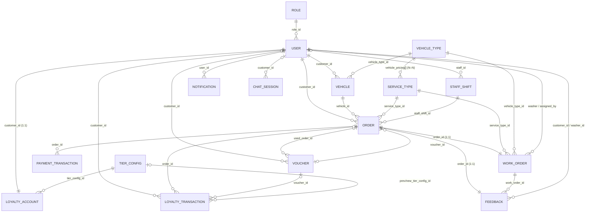

# AutoWash Pro — MongoDB Collection Design (FINAL) → ERD

**Phiên bản:** FINAL (as-built)
**Mục tiêu:** Liệt kê collections và trường dữ liệu để vẽ MongoDB diagram / ERD-style.
**Phạm vi:** Auth, Vehicle & Catalog, Booking (Order), Work Order, Payment, Voucher, Loyalty, Notification, Chat.
**Nguồn:** trích trực tiếp từ `src/modules/**/*.model.ts` (Mongoose). Đây là schema **thực tế đang chạy**, không phải bản thiết kế.

**Quyết định:** Dùng `roles` + `users`, không dùng `user_roles`; giá theo loại xe **nhúng** trong `service_types.vehicle_pricing[]` (không tách collection riêng); ca làm **ẩn danh theo capacity**.

---

## 1. Quy ước kiểu dữ liệu

| Type | Ý nghĩa |
|---|---|
| `ObjectId` | ID document hoặc khóa tham chiếu collection khác |
| `String` | Chuỗi |
| `Number` | Số |
| `Decimal128` | Tiền, giá (VND) |
| `Boolean` | Đúng / sai |
| `Date` | Ngày giờ |
| `[ ]` | Mảng (vd `[String]`, `[embedded]`) |
| `Mixed/Object` | Object tự do (không định kiểu) |

**Convention chung cho mọi collection:**
- `_id`: ObjectId, PK, auto-generated.
- `created_at`, `updated_at`: Date, auto Mongoose timestamps (đã rename từ `createdAt/updatedAt`).

---

## 2. Danh sách collections (19)

| # | Collection | Mục đích nghiệp vụ |
|---|---|---|
| 1 | `roles` | Vai trò chính của người dùng. |
| 2 | `users` | Tài khoản customer, cashier, washer, manager, admin (1 role chính qua `role_id`). |
| 3 | `vehicle_types` | Loại xe để phân loại xe và cấu hình giá. |
| 4 | `vehicles` | Xe của customer. |
| 5 | `service_types` | Gói dịch vụ rửa xe + bảng giá theo loại xe (nhúng). |
| 6 | `staff_shifts` | Ca làm việc ẩn danh, theo capacity. |
| 7 | `orders` | Đơn đặt lịch rửa xe (aggregate root). |
| 8 | `payment_transactions` | Giao dịch thanh toán PayOS. |
| 9 | `work_orders` | Phiếu công việc (check-in → rửa → xong). |
| 10 | `vouchers` | Phiếu ưu đãi (free wash). |
| 11 | `tier_configs` | Cấu hình hạng thành viên. |
| 12 | `loyalty_accounts` | Tài khoản tích điểm của customer. |
| 13 | `loyalty_transactions` | Lịch sử biến động điểm/hạng. |
| 14 | `pricing_policies` | Chính sách giá (singleton). |
| 15 | `golden_hour_configs` | Cấu hình khung giờ vàng giảm giá. |
| 16 | `feedbacks` | Đánh giá của khách cho washer. |
| 17 | `notifications` | Thông báo theo user. |
| 18 | `chat_sessions` | Phiên chat (chatbot). |
| 19 | `chat_knowledge` | Cơ sở tri thức chatbot (FAQ). |

---

## 3. Chi tiết collections

## 3.1 `roles`

**Mục đích:** Vai trò chính của người dùng.

| Field | Type | Required | Reference | Mô tả |
|---|---:|:---:|---|---|
| `_id` | `ObjectId` | Yes | `—` | ID role |
| `code` | `String` | Yes | `—` | customer \| cashier \| washer \| manager \| admin |
| `name` | `String` | Yes | `—` | Tên hiển thị |
| `description` | `String` | No | `—` | Mô tả role |
| `is_active` | `Boolean` | Yes | `—` | Role còn hoạt động |
| `created_at` | `Date` | Yes | `—` | Ngày tạo |
| `updated_at` | `Date` | Yes | `—` | Ngày cập nhật |

**Enum / Giá trị hợp lệ:**

```txt
code = customer | cashier | washer | manager | admin
```

**Index đề xuất:**

```js
{ code: 1 } unique
```

---

## 3.2 `users`

**Mục đích:** Tài khoản mọi vai trò. Bản này dùng 1 role chính qua `role_id`.

| Field | Type | Required | Reference | Mô tả |
|---|---:|:---:|---|---|
| `_id` | `ObjectId` | Yes | `—` | ID user |
| `role_id` | `ObjectId` | Yes | `roles._id` | Role chính |
| `name` | `String` | Yes | `—` | Họ tên |
| `phone` | `String` | Yes | `—` | Số điện thoại |
| `email` | `String` | Yes | `—` | Email (lowercase) |
| `password_hash` | `String` | Yes | `—` | Mật khẩu đã hash |
| `avatar_url` | `String` | No | `—` | Ảnh đại diện |
| `date_of_birth` | `Date` | No | `—` | Ngày sinh |
| `is_active` | `Boolean` | Yes | `—` | Tài khoản hoạt động |
| `delete_requested_at` | `Date` | No | `—` | Ngày yêu cầu xóa account |
| `email_verified_at` | `Date` | No | `—` | Lần xác thực OTP email gần nhất |
| `created_at` | `Date` | Yes | `—` | Ngày tạo |
| `updated_at` | `Date` | Yes | `—` | Ngày cập nhật |

**Index đề xuất:**

```js
{ phone: 1 } unique; { email: 1 } unique; { role_id: 1 }
```

---

## 3.3 `vehicle_types`

**Mục đích:** Loại xe để phân loại xe và hỗ trợ cấu hình giá.

| Field | Type | Required | Reference | Mô tả |
|---|---:|:---:|---|---|
| `_id` | `ObjectId` | Yes | `—` | ID loại xe |
| `name` | `String` | Yes | `—` | Motorbike, Car, SUV... |
| `description` | `String` | No | `—` | Mô tả |
| `is_active` | `Boolean` | Yes | `—` | Còn dùng |
| `created_at` | `Date` | Yes | `—` | Ngày tạo |
| `updated_at` | `Date` | Yes | `—` | Ngày cập nhật |

**Index đề xuất:**

```js
{ name: 1 } unique; { is_active: 1 }
```

---

## 3.4 `vehicles`

**Mục đích:** Xe của customer.

| Field | Type | Required | Reference | Mô tả |
|---|---:|:---:|---|---|
| `_id` | `ObjectId` | Yes | `—` | ID xe |
| `customer_id` | `ObjectId` | Yes | `users._id` | Chủ xe |
| `vehicle_type_id` | `ObjectId` | Yes | `vehicle_types._id` | Loại xe |
| `license_plate` | `String` | Yes | `—` | Biển số |
| `nickname` | `String` | No | `—` | Tên gợi nhớ |
| `brand` | `String` | No | `—` | Hãng xe |
| `car_model` | `String` | No | `—` | Dòng xe (đổi tên từ `model` do đụng Mongoose Model<T>) |
| `color` | `String` | No | `—` | Màu xe |
| `is_default` | `Boolean` | Yes | `—` | Xe mặc định (≤ 1 true/khách, ép ở service) |
| `is_active` | `Boolean` | Yes | `—` | Xe còn dùng |
| `created_at` | `Date` | Yes | `—` | Ngày tạo |
| `updated_at` | `Date` | Yes | `—` | Ngày cập nhật |

**Index đề xuất:**

```js
{ license_plate: 1 } unique; { customer_id: 1, is_active: 1 }
```

---

## 3.5 `service_types`

**Mục đích:** Gói dịch vụ rửa xe + bảng giá theo loại xe (nhúng). `base_price` là giá cơ bản; giá thực tế theo loại xe lấy trong `vehicle_pricing[]`.

| Field | Type | Required | Reference | Mô tả |
|---|---:|:---:|---|---|
| `_id` | `ObjectId` | Yes | `—` | ID dịch vụ |
| `name` | `String` | Yes | `—` | Tên dịch vụ |
| `description` | `String` | No | `—` | Mô tả |
| `base_price` | `Decimal128` | Yes | `—` | Giá cơ bản (VND) |
| `estimated_minutes` | `Number` | Yes | `—` | Thời lượng dự kiến |
| `points_multiplier` | `Number` | Yes | `—` | Hệ số tích điểm |
| `checklist_template` | `[String]` | No | `—` | Mẫu checklist công việc |
| `is_voucher_eligible` | `Boolean` | Yes | `—` | Được dùng voucher hay không |
| `vehicle_pricing` | `[embedded]` | No | `—` | Bảng giá theo loại xe (xem sub-document) |
| `is_active` | `Boolean` | Yes | `—` | Còn bán |
| `created_at` | `Date` | Yes | `—` | Ngày tạo |
| `updated_at` | `Date` | Yes | `—` | Ngày cập nhật |

**Sub-document `vehicle_pricing[]` (`_id: false`):**

| Field | Type | Required | Reference | Mô tả |
|---|---:|:---:|---|---|
| `vehicle_type_id` | `ObjectId` | Yes | `vehicle_types._id` | Áp giá cho loại xe nào |
| `price` | `Decimal128` | Yes | `—` | Giá cho loại xe đó |
| `estimated_minutes` | `Number` | Yes | `—` | Thời lượng cho loại xe đó |
| `is_active` | `Boolean` | Yes | `—` | Dòng giá còn hiệu lực |

**Index đề xuất:**

```js
{ name: 1 } unique; { is_active: 1 }
```

---

## 3.6 `staff_shifts`

**Mục đích:** Ca làm việc **ẩn danh theo capacity** (1 ca = 1 khung giờ có sức chứa rửa đồng thời). `staff_id` optional cho dữ liệu cũ.

| Field | Type | Required | Reference | Mô tả |
|---|---:|:---:|---|---|
| `_id` | `ObjectId` | Yes | `—` | ID ca |
| `staff_id` | `ObjectId` | No | `users._id` | Nhân viên (optional — ca ẩn danh) |
| `shift_type` | `String` | Yes | `—` | cashier \| washer (default washer) |
| `station_name` | `String` | No | `—` | Tên trạm (legacy) |
| `capacity` | `Number` | Yes | `—` | Sức chứa (số xe rửa đồng thời), min 1 |
| `start_at` | `Date` | Yes | `—` | Bắt đầu ca |
| `end_at` | `Date` | Yes | `—` | Kết thúc ca |
| `status` | `String` | Yes | `—` | scheduled \| active \| completed \| cancelled |
| `note` | `String` | No | `—` | Ghi chú |
| `created_at` | `Date` | Yes | `—` | Ngày tạo |
| `updated_at` | `Date` | Yes | `—` | Ngày cập nhật |

**Enum / Giá trị hợp lệ:**

```txt
shift_type = cashier | washer
status     = scheduled | active | completed | cancelled
```

> Ghi chú: status hiệu lực suy ra theo thời gian (`effectiveShiftStatus`), chỉ `cancelled` là lưu cứng.

**Index đề xuất:**

```js
{ staff_id: 1, start_at: -1 }; { shift_type: 1, status: 1 }
```

---

## 3.7 `orders`

**Mục đích:** Đơn đặt lịch rửa xe — aggregate root của luồng đặt lịch + thanh toán.

| Field | Type | Required | Reference | Mô tả |
|---|---:|:---:|---|---|
| `_id` | `ObjectId` | Yes | `—` | ID đơn |
| `customer_id` | `ObjectId` | Yes | `users._id` | Khách đặt |
| `vehicle_id` | `ObjectId` | Yes | `vehicles._id` | Xe được rửa |
| `service_type_id` | `ObjectId` | Yes | `service_types._id` | Gói dịch vụ |
| `staff_shift_id` | `ObjectId` | Yes | `staff_shifts._id` | Ca giữ slot |
| `scheduled_at` | `Date` | Yes | `—` | Giờ hẹn |
| `estimated_minutes` | `Number` | Yes | `—` | Thời lượng ước tính |
| `status` | `String` | Yes | `—` | Trạng thái đơn (state machine) |
| `priority_level` | `Number` | Yes | `—` | Mức ưu tiên (theo tier) |
| `reschedule_count` | `Number` | Yes | `—` | Số lần dời lịch |
| `cancel_reason` | `String` | No | `—` | Lý do hủy |
| `note` | `String` | No | `—` | Ghi chú |
| `payment_method` | `String` | Yes | `—` | online \| cash |
| `payment_status` | `String` | Yes | `—` | unpaid \| paid \| refunded |
| `amount` | `Number` | Yes | `—` | Số tiền phải trả (sau giảm) |
| `original_amount` | `Number` | Yes | `—` | Giá gốc |
| `discount_amount` | `Number` | Yes | `—` | Số tiền giảm |
| `discount_percent` | `Number` | Yes | `—` | % giảm (0–100) |
| `discount_reason` | `String` | No | `—` | Lý do giảm |
| `voucher_id` | `ObjectId` | No | `vouchers._id` | Voucher áp dụng (optional) |
| `payos_order_code` | `Number` | No | `—` | Mã đơn PayOS (unique sparse) |
| `payos_checkout_url` | `String` | No | `—` | Link thanh toán |
| `payos_payment_link_id` | `String` | No | `—` | ID link thanh toán PayOS |
| `created_at` | `Date` | Yes | `—` | Ngày tạo |
| `updated_at` | `Date` | Yes | `—` | Ngày cập nhật |

**Enum / Giá trị hợp lệ:**

```txt
status         = pending_payment | confirmed | checked_in | in_progress | completed | cancelled | no_show
payment_method = online | cash
payment_status = unpaid | paid | refunded
```

**Index đề xuất:**

```js
{ customer_id: 1, scheduled_at: -1 }; { scheduled_at: 1, status: 1 };
{ customer_id: 1, status: 1 }; { staff_shift_id: 1, status: 1 };
{ payos_order_code: 1 } unique sparse
```

---

## 3.8 `payment_transactions`

**Mục đích:** Giao dịch thanh toán từ webhook PayOS (audit + idempotency).

| Field | Type | Required | Reference | Mô tả |
|---|---:|:---:|---|---|
| `_id` | `ObjectId` | Yes | `—` | ID giao dịch |
| `order_id` | `ObjectId` | Yes | `orders._id` | Đơn liên quan |
| `order_code` | `Number` | Yes | `—` | Mã đơn PayOS (denormalized) |
| `payos_transaction_id` | `String` | No | `—` | ID giao dịch PayOS (idempotency guard) |
| `amount` | `Number` | Yes | `—` | Số tiền |
| `status` | `String` | Yes | `—` | Trạng thái/desc từ PayOS |
| `raw_data` | `Object` | No | `—` | Toàn bộ payload webhook |
| `transaction_datetime` | `Date` | No | `—` | Thời điểm PayOS xác nhận |
| `created_at` | `Date` | Yes | `—` | Ngày tạo |
| `updated_at` | `Date` | Yes | `—` | Ngày cập nhật |

**Index đề xuất:**

```js
{ order_id: 1 }; { order_code: 1 }; { payos_transaction_id: 1 } unique sparse
```

---

## 3.9 `work_orders`

**Mục đích:** Phiếu công việc sinh khi check-in — theo dõi washer thực hiện. 1 order ↔ 1 work_order.

| Field | Type | Required | Reference | Mô tả |
|---|---:|:---:|---|---|
| `_id` | `ObjectId` | Yes | `—` | ID phiếu việc |
| `order_id` | `ObjectId` | Yes | `orders._id` | Đơn nguồn (unique — 1:1) |
| `code` | `String` | Yes | `—` | Mã phiếu công việc (unique) |
| `vehicle_snapshot` | `embedded` | Yes | `—` | Snapshot xe lúc check-in (xem sub-document) |
| `service_name` | `String` | Yes | `—` | Tên dịch vụ (snapshot) |
| `service_type_id` | `ObjectId` | Yes | `service_types._id` | Gói dịch vụ |
| `vehicle_type_id` | `ObjectId` | Yes | `vehicle_types._id` | Loại xe |
| `scheduled_at` | `Date` | Yes | `—` | Giờ hẹn |
| `preferred_washer_id` | `ObjectId` | No | `users._id` | Washer ưu tiên |
| `checkin_photos` | `[String]` | No | `—` | Ảnh check-in |
| `checkout_photos` | `[String]` | No | `—` | Ảnh check-out |
| `status` | `String` | Yes | `—` | waiting \| assigned \| in_progress \| done |
| `assigned_washer_id` | `ObjectId` | No | `users._id` | Washer được giao |
| `assigned_by` | `ObjectId` | No | `users._id` | Người giao việc |
| `estimated_minutes` | `Number` | Yes | `—` | Thời lượng ước tính |
| `station_name` | `String` | No | `—` | Tên trạm |
| `started_at` | `Date` | No | `—` | Bắt đầu rửa |
| `finished_at` | `Date` | No | `—` | Rửa xong |
| `created_at` | `Date` | Yes | `—` | Ngày tạo |
| `updated_at` | `Date` | Yes | `—` | Ngày cập nhật |

**Sub-document `vehicle_snapshot` (`_id: false`):**

| Field | Type | Required | Reference | Mô tả |
|---|---:|:---:|---|---|
| `plate` | `String` | Yes | `—` | Biển số (snapshot) |
| `vehicle_type_name` | `String` | Yes | `—` | Tên loại xe (snapshot) |
| `color` | `String` | No | `—` | Màu xe |

**Enum / Giá trị hợp lệ:**

```txt
status = waiting | assigned | in_progress | done
```

**Index đề xuất:**

```js
{ order_id: 1 } unique; { code: 1 } unique;
{ assigned_washer_id: 1, status: 1 }; { status: 1, scheduled_at: 1, created_at: 1 }
```

---

## 3.10 `vouchers`

**Mục đích:** Phiếu ưu đãi (free wash). `customer_id` optional: voucher "pool" chưa có chủ đến khi khách claim.

| Field | Type | Required | Reference | Mô tả |
|---|---:|:---:|---|---|
| `_id` | `ObjectId` | Yes | `—` | ID voucher |
| `customer_id` | `ObjectId` | No | `users._id` | Chủ voucher (optional) |
| `code` | `String` | Yes | `—` | Mã voucher (unique) |
| `type` | `String` | Yes | `—` | free_wash |
| `status` | `String` | Yes | `—` | unused \| used \| expired |
| `discount_cap_vnd` | `Number` | Yes | `—` | Trần giảm (VND) |
| `expires_at` | `Date` | Yes | `—` | Hạn dùng |
| `granted_reason` | `String` | No | `—` | Lý do cấp |
| `used_at` | `Date` | No | `—` | Thời điểm dùng |
| `used_order_id` | `ObjectId` | No | `orders._id` | Đơn đã dùng voucher |
| `created_at` | `Date` | Yes | `—` | Ngày tạo |
| `updated_at` | `Date` | Yes | `—` | Ngày cập nhật |

**Enum / Giá trị hợp lệ:**

```txt
type   = free_wash
status = unused | used | expired
```

**Index đề xuất:**

```js
{ code: 1 } unique; { customer_id: 1, status: 1 }; { type: 1 }; { expires_at: 1 }
```

---

## 3.11 `tier_configs`

**Mục đích:** Cấu hình hạng thành viên.

| Field | Type | Required | Reference | Mô tả |
|---|---:|:---:|---|---|
| `_id` | `ObjectId` | Yes | `—` | ID tier |
| `tier_name` | `String` | Yes | `—` | None \| Bronze \| Silver \| Gold |
| `min_loyalty_points` | `Number` | Yes | `—` | Điểm tối thiểu để đạt hạng |
| `booking_window_days` | `Number` | Yes | `—` | Số ngày được đặt trước |
| `priority_level` | `Number` | Yes | `—` | Mức ưu tiên (unique) |
| `points_per_1000_vnd` | `Number` | Yes | `—` | Điểm tích trên mỗi 1000đ |
| `discount_percent` | `Number` | Yes | `—` | % giảm theo hạng (0–100) |
| `is_active` | `Boolean` | Yes | `—` | Còn dùng |
| `created_at` | `Date` | Yes | `—` | Ngày tạo |
| `updated_at` | `Date` | Yes | `—` | Ngày cập nhật |

**Enum / Giá trị hợp lệ:**

```txt
tier_name = None | Bronze | Silver | Gold
```

**Index đề xuất:**

```js
{ tier_name: 1 } unique; { priority_level: 1 } unique
```

---

## 3.12 `loyalty_accounts`

**Mục đích:** Ví điểm + hạng hiện tại của customer. 1 khách ↔ 1 account.

| Field | Type | Required | Reference | Mô tả |
|---|---:|:---:|---|---|
| `_id` | `ObjectId` | Yes | `—` | ID loyalty account |
| `customer_id` | `ObjectId` | Yes | `users._id` | Customer (unique — 1:1) |
| `tier_config_id` | `ObjectId` | Yes | `tier_configs._id` | Hạng hiện tại |
| `points_balance` | `Number` | Yes | `—` | Số dư điểm |
| `successful_washes_toward_voucher` | `Number` | Yes | `—` | Số lần rửa tính về voucher |
| `spend_toward_voucher` | `Number` | Yes | `—` | Chi tiêu tính về voucher |
| `total_successful_washes` | `Number` | Yes | `—` | Tổng số lần rửa thành công |
| `last_annual_reset_at` | `Date` | No | `—` | Lần reset điểm hằng năm gần nhất |
| `created_at` | `Date` | Yes | `—` | Ngày tạo |
| `updated_at` | `Date` | Yes | `—` | Ngày cập nhật |

**Index đề xuất:**

```js
{ customer_id: 1 } unique; { tier_config_id: 1 }
```

---

## 3.13 `loyalty_transactions`

**Mục đích:** Lịch sử biến động điểm/hạng (nên immutable).

| Field | Type | Required | Reference | Mô tả |
|---|---:|:---:|---|---|
| `_id` | `ObjectId` | Yes | `—` | ID transaction |
| `customer_id` | `ObjectId` | Yes | `users._id` | Customer |
| `type` | `String` | Yes | `—` | Loại biến động |
| `points_delta` | `Number` | Yes | `—` | Thay đổi điểm (+/-) |
| `balance_after` | `Number` | Yes | `—` | Số dư sau giao dịch |
| `order_id` | `ObjectId` | No | `orders._id` | Đơn liên quan |
| `voucher_id` | `ObjectId` | No | `vouchers._id` | Voucher liên quan |
| `previous_tier_config_id` | `ObjectId` | No | `tier_configs._id` | Hạng trước |
| `new_tier_config_id` | `ObjectId` | No | `tier_configs._id` | Hạng sau |
| `reason` | `String` | No | `—` | Lý do |
| `created_at` | `Date` | Yes | `—` | Ngày tạo |
| `updated_at` | `Date` | Yes | `—` | Ngày cập nhật |

**Enum / Giá trị hợp lệ:**

```txt
type = earn_completed | deduct_no_show | annual_reset | voucher_granted | tier_changed
```

**Index đề xuất:**

```js
{ customer_id: 1, created_at: -1 }; { type: 1 }; { order_id: 1 }
```

---

## 3.14 `pricing_policies`

**Mục đích:** Chính sách giá toàn cục — **singleton** (1 document, pin bởi `key`).

| Field | Type | Required | Reference | Mô tả |
|---|---:|:---:|---|---|
| `_id` | `ObjectId` | Yes | `—` | ID policy |
| `key` | `String` | Yes | `—` | Khóa singleton (default `global`) |
| `max_stacked_discount_percent` | `Number` | Yes | `—` | Trần tổng % giảm khi cộng dồn (0–100, default 50) |
| `created_at` | `Date` | Yes | `—` | Ngày tạo |
| `updated_at` | `Date` | Yes | `—` | Ngày cập nhật |

**Index đề xuất:**

```js
{ key: 1 } unique
```

---

## 3.15 `golden_hour_configs`

**Mục đích:** Cấu hình khung giờ vàng giảm giá.

| Field | Type | Required | Reference | Mô tả |
|---|---:|:---:|---|---|
| `_id` | `ObjectId` | Yes | `—` | ID cấu hình |
| `name` | `String` | Yes | `—` | Tên cấu hình |
| `days_of_week` | `[Number]` | No | `—` | Ngày áp dụng (0=CN … 6=T7; rỗng = mọi ngày) |
| `start_minute` | `Number` | Yes | `—` | Phút bắt đầu trong ngày (0–1439) |
| `end_minute` | `Number` | Yes | `—` | Phút kết thúc trong ngày (1–1440) |
| `timezone` | `String` | Yes | `—` | Múi giờ (default `Asia/Ho_Chi_Minh`) |
| `discount_percent` | `Number` | Yes | `—` | % giảm giờ vàng (0–100) |
| `is_active` | `Boolean` | Yes | `—` | Còn dùng |
| `created_at` | `Date` | Yes | `—` | Ngày tạo |
| `updated_at` | `Date` | Yes | `—` | Ngày cập nhật |

**Index đề xuất:**

```js
{ is_active: 1 }
```

---

## 3.16 `feedbacks`

**Mục đích:** Đánh giá của khách cho 1 đơn đã xong, quy về washer đã làm. 1 order ↔ 1 feedback.

| Field | Type | Required | Reference | Mô tả |
|---|---:|:---:|---|---|
| `_id` | `ObjectId` | Yes | `—` | ID feedback |
| `order_id` | `ObjectId` | Yes | `orders._id` | Đơn được đánh giá (unique — 1:1) |
| `work_order_id` | `ObjectId` | Yes | `work_orders._id` | Phiếu công việc liên quan |
| `customer_id` | `ObjectId` | Yes | `users._id` | Khách đánh giá |
| `washer_id` | `ObjectId` | Yes | `users._id` | Washer được đánh giá |
| `rating` | `Number` | Yes | `—` | Điểm đánh giá (1–5) |
| `comment` | `String` | No | `—` | Nhận xét (≤ 1000) |
| `created_at` | `Date` | Yes | `—` | Ngày tạo |
| `updated_at` | `Date` | Yes | `—` | Ngày cập nhật |

**Index đề xuất:**

```js
{ order_id: 1 } unique; { washer_id: 1, created_at: -1 }; { customer_id: 1, created_at: -1 }
```

---

## 3.17 `notifications`

**Mục đích:** Thông báo thuộc về 1 user, lưu DB để có lịch sử + đếm chưa đọc.

| Field | Type | Required | Reference | Mô tả |
|---|---:|:---:|---|---|
| `_id` | `ObjectId` | Yes | `—` | ID thông báo |
| `user_id` | `ObjectId` | Yes | `users._id` | Người nhận |
| `type` | `String` | Yes | `—` | Loại thông báo |
| `title` | `String` | Yes | `—` | Tiêu đề |
| `body` | `String` | Yes | `—` | Nội dung |
| `data` | `Mixed` | No | `—` | Ngữ cảnh điều hướng (vd `{ orderId, workOrderId, plate }`) |
| `is_read` | `Boolean` | Yes | `—` | Đã đọc |
| `created_at` | `Date` | Yes | `—` | Ngày tạo |
| `updated_at` | `Date` | Yes | `—` | Ngày cập nhật |

**Enum / Giá trị hợp lệ:**

```txt
type = order_created | wash_assigned | wash_started | wash_completed | feedback_created
```

**Index đề xuất:**

```js
{ user_id: 1, created_at: -1 }; { user_id: 1, is_read: 1 }
```

---

## 3.18 `chat_sessions`

**Mục đích:** Phiên chat với chatbot. `customer_id` nullable cho khách vãng lai.

| Field | Type | Required | Reference | Mô tả |
|---|---:|:---:|---|---|
| `_id` | `ObjectId` | Yes | `—` | ID phiên |
| `customer_id` | `ObjectId` | No | `users._id` | Khách (null nếu vãng lai) |
| `session_id` | `String` | Yes | `—` | ID phiên (unique) |
| `messages` | `[embedded]` | No | `—` | Lịch sử tin nhắn (xem sub-document) |
| `metadata` | `Mixed` | No | `—` | Metadata phiên |
| `created_at` | `Date` | Yes | `—` | Ngày tạo |
| `updated_at` | `Date` | Yes | `—` | Ngày cập nhật |

**Sub-document `messages[]` (`_id: false`):**

| Field | Type | Required | Reference | Mô tả |
|---|---:|:---:|---|---|
| `role` | `String` | Yes | `—` | user \| model |
| `content` | `String` | Yes | `—` | Nội dung tin nhắn |
| `created_at` | `Date` | Yes | `—` | Thời điểm |

**Index đề xuất:**

```js
{ customer_id: 1 }; { session_id: 1 } unique
```

---

## 3.19 `chat_knowledge`

**Mục đích:** Cơ sở tri thức (FAQ) cho chatbot — tìm bằng full-text.

| Field | Type | Required | Reference | Mô tả |
|---|---:|:---:|---|---|
| `_id` | `ObjectId` | Yes | `—` | ID tri thức |
| `question` | `String` | Yes | `—` | Câu hỏi |
| `answer` | `String` | Yes | `—` | Câu trả lời |
| `keywords` | `[String]` | No | `—` | Từ khóa |
| `category` | `String` | No | `—` | Danh mục |
| `is_active` | `Boolean` | Yes | `—` | Còn dùng |
| `created_at` | `Date` | Yes | `—` | Ngày tạo |
| `updated_at` | `Date` | Yes | `—` | Ngày cập nhật |

**Index đề xuất:**

```js
{ keywords: 1 }; { category: 1 }; { is_active: 1 };
{ question: "text", answer: "text", keywords: "text" }   // chat_knowledge_text_idx
```

---

## 4. Quan hệ chính để vẽ diagram

```txt
[Auth & User]
roles 1 ─── N users

[Vehicle & Catalog]
users 1 ─── N vehicles
vehicle_types 1 ─── N vehicles
vehicle_types 1 ─── N service_types.vehicle_pricing[]   // nhúng (N–N service_types ↔ vehicle_types)

[Shift]
users 1 ─── N staff_shifts               // staff_id (optional)

[Order / Booking]
users 1 ─── N orders                     // customer_id
vehicles 1 ─── N orders                  // vehicle_id
service_types 1 ─── N orders             // service_type_id
staff_shifts 1 ─── N orders              // staff_shift_id
vouchers 1 ─── N orders                  // voucher_id (optional)

orders 1 ─── N payment_transactions      // order_id
orders 1 ─── 1 work_orders               // order_id (unique)
orders 1 ─── 1 feedbacks                 // order_id (unique)

[Work Order]
service_types 1 ─── N work_orders        // service_type_id
vehicle_types 1 ─── N work_orders        // vehicle_type_id
users 1 ─── N work_orders                // assigned_washer_id / preferred_washer_id / assigned_by (optional)
work_orders 1 ─── N feedbacks            // work_order_id

[Feedback]
users 1 ─── N feedbacks                  // customer_id + washer_id

[Voucher]
users 1 ─── N vouchers                   // customer_id (optional)
orders 1 ─── N vouchers                  // used_order_id (optional)

[Loyalty]
users 1 ─── 1 loyalty_accounts           // customer_id (unique)
tier_configs 1 ─── N loyalty_accounts    // tier_config_id
users 1 ─── N loyalty_transactions       // customer_id
orders 1 ─── N loyalty_transactions      // order_id (optional)
vouchers 1 ─── N loyalty_transactions    // voucher_id (optional)
tier_configs 1 ─── N loyalty_transactions // previous/new_tier_config_id (optional)

[Notification & Chat]
users 1 ─── N notifications              // user_id
users 1 ─── N chat_sessions              // customer_id (optional)

[Độc lập — không quan hệ]
pricing_policies, golden_hour_configs, chat_knowledge
```

---

## 5. Sơ đồ ERD (Mermaid — trực quan)



---

*Tài liệu sinh từ source code Mongoose models (`src/modules/**/*.model.ts`) — cập nhật lại khi model thay đổi.*
